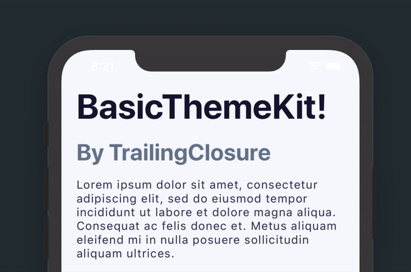

# BasicThemeKit
### SwiftUI Theme Kit

       

Written for [TrailingClosure.com](https://trailingclosure.com/).

> BasicThemeKit is a SwiftUI package that allows you to quickly format elements in your app around a common theme. All of the elements in the kit are made as a `ViewModifier` with an extension to `View`. This allows you to prototype quickly and maintain the readability of your code.


## Usage
**All of the elements are created as a `ViewModifier` with extensions placed on `View`.**

### Text
```swift
// H1 Header
Text("H1 Header String")
    .h1()
    
// H2 Header
Text("H2 Header String")
    .h2()

// H3 Header
Text("H3 Header String")
    .h3()

// H4 Header
Text("H4 Header String")
    .h4()

// Paragraph Styling
Text("This creates text formatted for a paragraph.")
    .paragraph()
```
### Buttons
```swift
// Primary Button
Button(action: {}) {
    Text("Primary Button")
        .primaryButton()
        .h4() // You can use text styling on buttons too!
}

// Border Button
Button(action: {}) {
    Text("Border Button")
        .borderButton()
        .h4()
}
```
### Block Quote
```swift
// Block Quote - Primary Styling
Text("Lorem ipsum dolor sit amet, consectetur adipiscing elit, sed do eiusmod tempor incididunt ut labore et dolore magna aliqua.")
    .paragraph()
    .blockQuote(style: .Primary)
/*
Other Styles:
    - .Success
    - .Warning
    - .Error
*/
```
### Notification Banner

```swift
// Change the bool value to toggle display of the Notification banner.
@State var bannerVisible: Bool = false

ZStack {
    // All of your normal content in here.
}
.banner(title: "Test Banner", subtitle: "Test subtitle for this notifcation I am displaying. Cool right!", style: .Primary, isVisible: $bannerVisible)

// Banner will automatically hide after a few seconds. That is why the bool value is passed as a binding.
/*
Other Styles:
    - .Success
    - .Warning
    - .Error
*/
```
### Setup
Install as a Swift Package using the link for this git repository.

`https://github.com/jboullianne/BasicThemeKit.git`

